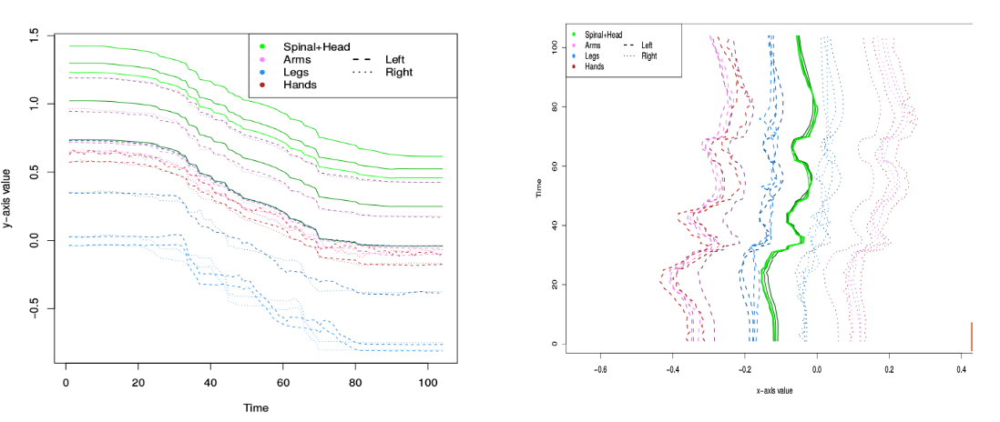
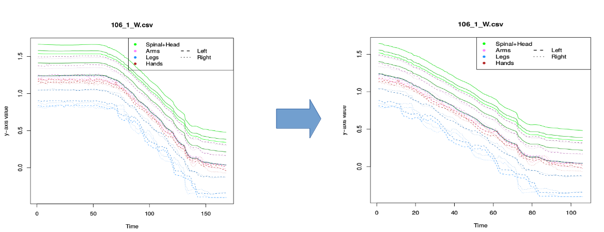
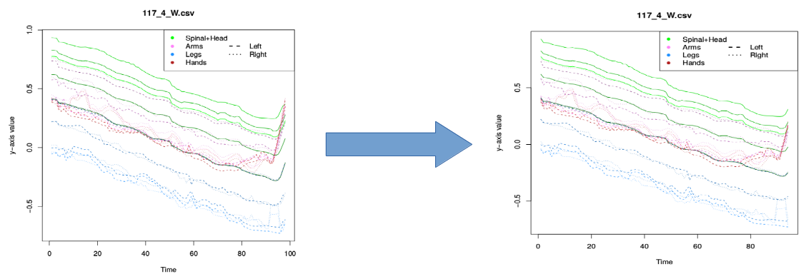
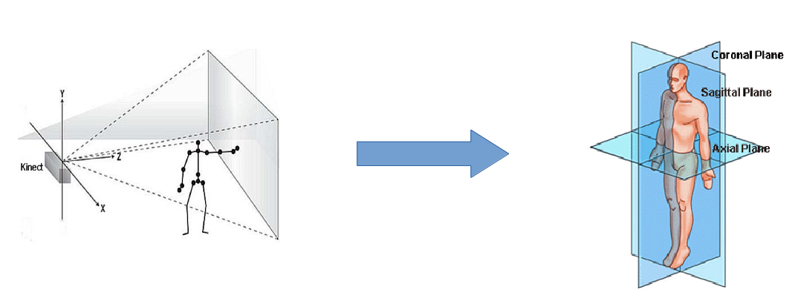

This is an R Markdown document. Markdown is a simple formatting syntax for authoring HTML, PDF, and MS Word documents. For more details on using R Markdown see <http://rmarkdown.rstudio.com>.

When you click the **Knit** button a document will be generated that includes both content as well as the output of any embedded R code chunks within the document. 

In this document, we cover the different aspects of the devGenes project using Kinect data and machine learning to estimate neurodevleopmental disorders (NDD) risk.

# **Task description**

All devGenes participants were asked to perform two balance/gait tasks recorder by the Microsoft Kinect. For both tasks, individuals have to walk along a line drawn on the ground in either a *standard* walk or in a *heel-toe* fashion. Each record contains the location of body points (mostly joints) in 3D coordinates from the camera perspectives.


# **Data pre-processing**

Given the recording process involved manual start and end, raw data were found to be too noisy to be used as such. In the following paragraphs, we describe the different transformations we applied to the data. To visualize the process, one can also refer to package in *src/pkg/demo.R*. This tool can also make predictions for NDD risk if a predictive model is provided as an input. We will use specific records to illustrate the corrections one might need to apply to a Kinect record. In the following figure, we represent the record of the different body points during a standard walking task along the 3 different directions.



## **Steady start/end**

As individuals and admninistrators might have a different reaction time to the beginning and end of the task, we look for the first and last points where there is a significant movement in all body points.

```{r, echo=T, eval=F}
########################################################
# Function returning the index of the first moving point
removeStart<-function(y,thresh=10^-3){
  i = 1
  tmp=y[i]
  while(abs(tmp)<thresh){
    i = i+1
    tmp=y[i]
  }
  return(i)
}

########################################################
# Function returning the index of the last moving point
removeEnd<-function(y,thresh=10^-3){
  i = 1
  tmp=rev(y)[i]
  while(abs(tmp)<thresh){
    i = i+1
    tmp=rev(y)[i]
  }
  return(length(y)-i)
}


##############################################
# Function trimming the steady start and end
removeSteady <- function(x){
  
  #compute the first derivative along Y-axis
  y = apply(x,2,computeDerivative)
  # trim steady start and end for each record
  start=removeStart(y[,2])   #process by removing steady start
  end=removeEnd(y[,2])   #process by removing steady end
  x.proc= x[c(start:end),] #keep actual moving time
  return(x.proc)
}
```



## **Odd start/end**

There is also times where the beginning and end of the task include additional noise due to individuals getting ready (especially arms related).

```{r,echo=T,eval=F}
##################################################
# Function detecting odd starts (too much movement)
# based on median value +/- 2*sd
pruneOddMvtStart <- function(x,thresh=2){
  med = apply(x,2,mean)
  inf = med -thresh*apply(x,2,sd)
  max = med + thresh*apply(x,2,sd)
  
  i = 1
  tmp=x[i,]
  while( any(tmp < inf) | any(tmp > max)){
    i = i+1
    tmp=x[i,]
  }
  return(i+1)
}

################################################
# Function detecting odd ends (too much movement)
# based on median value +/- 2*sd
pruneOddMvtEnd <- function(x,thresh = 2){
  med = apply(x,2,mean)
  inf = med -thresh*apply(x,2,sd)
  max = med + thresh*apply(x,2,sd)
  
  i = nrow(x)
  tmp=x[i,]
  while( any(tmp < inf) | any(tmp > max)){
    i = i-1
    tmp=x[i,]
  }
  return(i-1)
}

#####################################################
# Function detecting and removing odd starts and ends
removeOdd <- function(x){
  
  # trim start and end
  start=pruneOddMvtStart(x,thresh=2) #detect odd starts
  end=pruneOddMvtEnd(x,thresh=2)     #detect odd ends
  x.proc = x[c(start:end),] #remove
  
  return(x.proc)
}
```



## **Remove camera glitches**

For reasons that remain unknown, the camera had some rare glitches where all the body points got shifted.

```{r, echo=T, eval=F}

##########################################
# Function detecting and removing glitches 

removeGlitch <- function(x){
  #compute the first derivative along Y-axis
  y = apply(x,2,computeDerivative)
  #look for the point where, on average, each bodypoint has the highest variation
  tmp = max(apply(as.matrix(y,ncol=ncol(y)),1,function(i) mean(abs(i))))
  #detect glitch using a percentile/outlier
  idx = (tmp > 0.15) # empirical value found during February 2016 study
  # the output will be almost identical to the input
  x.proc = x
  #correct detected glitches
  if(idx){
    tmp = y
    j = which.max(apply(tmp,1,function(i) mean(abs(i)))) + 1
    if(j > 0.5*nrow(x.proc)){                     # remove the smaller part of the signal
      x.proc = x.proc[-c(j:nrow(x.list.proc[[i]])),]
    }else{
      x.proc = x.proc[-c(1:j),]
    } 
  }
  return(x.proc)
}

```


## **Rotate camera perspective into individual perspective**

Given the Kinect was often moved between records, the angle between the camera and the line on the ground is different. To address that, we correct the angle by rotating all the data using the individual sagittal plan.

```{r,echo=T,eval=F}

#########################################################################################################
# get center of mass direction (SpineBase point, instead of HipCenter that does not exist in our data)
getDirectionZ <-function(x){
  if(nrow(x) > 2){
    start = apply(x[1:(round(0.1*nrow(x))),1:3],2,mean) 
  }else{
    start = apply(x[1:2,1:3],2,mean) 
  }
  return(-start/sqrt(sum(start^2)))
}

################################################
#get y-axis given the direction SpineBase-Neck
getDirectionY <-function(x){
  spineBase = apply(x[,1:3],2,mean) 
  neck = apply(x[,7:9],2,mean)
  return((neck-spineBase)/sqrt(sum((neck-spineBase)^2)))
}

############################################################
# cross product function for 3D vectors
# Compute the vector cross product between x and y, and return the components indexed by i.
CrossProduct3D <- function(x, y, i=1:3) {
  # Project inputs into 3D, since the cross product only makes sense in 3D.
  To3D <- function(x) head(c(x, rep(0, 3)), 3)
  x <- To3D(x)
  y <- To3D(y)
  
  # Indices should be treated cyclically (i.e., index 4 is "really" index 1, and
  # so on).  Index3D() lets us do that using R's convention of 1-based (rather
  # than 0-based) arrays.
  Index3D <- function(i) (i - 1) %% 3 + 1
  
  # The i'th component of the cross product is:
  # (x[i + 1] * y[i + 2]) - (x[i + 2] * y[i + 1])
  # as long as we treat the indices cyclically.
  return (x[Index3D(i + 1)] * y[Index3D(i + 2)] -
            x[Index3D(i + 2)] * y[Index3D(i + 1)])
}

#######################################################
#get x-axis based on y and z axes crossproduct
getDirectionX <- function(y,z){
  return(CrossProduct3D(y,z,i=1:3))
}

########################################################
# Function rotating data in the sagittal plan
rotateData <- function(x){
  #compute direction along z-axis
  z_directions = getDirectionZ(x)
  #compute direction along y-axis
  y_directions = getDirectionY(x)
  #compute direction along x-axis
  x_directions = getDirectionX(y_directions,z_directions)
  
  #apply rotation to the data
  x.proc = list()
  #bind x,y,z directions in a rotation matrix
  rotate = cbind(x_directions, y_directions, z_directions)
  tmp = NULL
  for(j in 1:(ncol(x)/3)){
    # rotate data
    tmp = cbind(tmp, x[,3*j-c(2:0)]%*%rotate)
  }
  x.proc = tmp
  return(x.proc)
}

```


## **From time-series to frequency domain**

Given all records have a different length, we cannot use the time-dependent signal as an input for machine learning, that requires all observations to have the same number of features. Therefore, we applier Fourier transform to all the records to extract the amplitude of top 10 frequencies.

```{r,echo=T,eval=F}

###################################################################################3
# Fourier analysis of records signal
# Function computing the frequency domain for nfreq and bodysite(s)
computeFreq <- function(x,nfreq = 10,bodysite = c(1:25)){
  #remove trend (constant component) ~ bias in signal
  tmp = apply(x[,sort(3*bodysite-rep(c(0,1,2),length(bodysite)))],2,function(y)lm(y ~ c(1:length(y))))
  detrended.trajectory <- lapply(tmp,function(y)y$residuals)
  #apply Fourier analysis
  X.k <- lapply(detrended.trajectory,fft)
  #get the power of each component (Module)
  mod = lapply(X.k,function(y)Mod(y[2:(nfreq+1)])^2)
  #output matrix: row = bodysite, col = 3*nfreq
  X = t(matrix(unlist(mod),ncol=length(bodysite),nrow=nfreq*3))
  return(X)
}

########################################################################
# Function converting temporal data into frequency data using Fourier 
applyFourier <- function(x,nfreq = 10,bodysite = c(1:25)){
  #set default body points
  bodyPoints = c('SpineBase','SpineMid','Neck','Head','ShoulderLeft','ElbowLeft','WristLeft','HandLeft','ShoulderRight','ElbowRight','WristRight','HandRight',
                 'HipLeft','KneeLeft','AnkleLeft','FootLeft','HipRight','KneeRight','AnkleRight','FootRight','SpineShoulder','HandTipLeft','ThumbLeft','HandTipRight','ThumbRight')[bodysite]
  
  # compute frequency component for each record
  data = computeFreq(x,nfreq=nfreq,bodysite=bodysite)
  data = as.vector(t(data))
  #compute the new feature names
  tmp2 = outer(outer(c('X','Y','Z'),paste("Freq",1:nfreq),paste,sep='.'),bodyPoints[bodyPoints != '' & !is.na(bodyPoints)],paste,sep='.')
  tmp3 = NULL
  for(i in 1:dim(tmp2)[3]) tmp3 = c(tmp3, as.vector(t(tmp2[,,i])))
  names(data) = tmp3
  return(data)
}

```


# **References**

Here are some interesting articles we might want to cite:

- Motion tracking and gait features estimation for recognising Parkinson's using MS Kinect

- Full body Analysis with Kinect

- Feature Extraction for the Analsyis of Gait and Human Motion

- Three-dimensional Kinematic Analysis using the Xbox Kinect

- Accuracy of the Microsoft Kinect for measuring gait parameters during treadmill walking

- Kinect as a tool for gait analysis: validation of a real-time joint extraction algorithm working in side view
