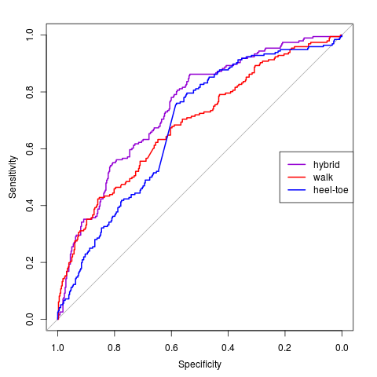
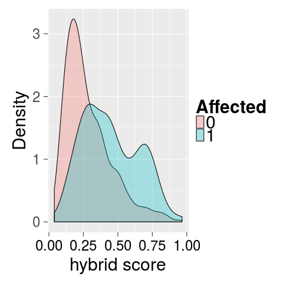
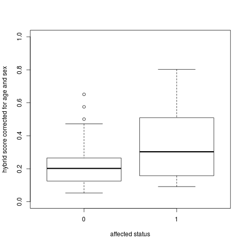

```{r setup, include=FALSE}
knitr::opts_chunk$set(echo = TRUE)
```

## R Markdown

This is an R Markdown document. Markdown is a simple formatting syntax for authoring HTML, PDF, and MS Word documents. For more details on using R Markdown see <http://rmarkdown.rstudio.com>.

When you click the **Knit** button a document will be generated that includes both content as well as the output of any embedded R code chunks within the document. You can embed an R code chunk like this:


# **Machine learning for imbalance and movement impairment detection**

In this section, we described each step for training the different predictive models based on Kinect records and their association to affected status.

## **Training dataset preparation**

We combine records from devGenes participants and from the Iowa City Museum. For each of them, we convert the records in frequency profiles, for both standard and heel-toe tasks.

```{r,echo=T,eval=F}

source('../src/kinect_analysis_tool.R')
##################
# PRE-PROCESSING #
#----------------#

#stats on metadata
# TODO: remove when data re uploaded on the repository meta = read.csv('/wdata/devGenes/9.19.16 Data to Kevin for Gait Model.csv',header=T) #146 individuals
meta = read.csv('../data/metadata.csv',header=T)

table(meta$Male) #318 F /323 M
table(meta$Caucasian) #66 / 42 Caucasian
table(meta$Affected) # 412 non-affected / 229 affected

#get header
x = read.csv2("../data/Kevin.1.1.csv",header=F,stringsAsFactors = F)
bodyPoints = x[1,]

# TODO: what will be the format for the data release
#read all files - devGenes
x.list.devgenes = list()
for(family in c(101:289)){
 # files=list.files(paste('/wdata/devGenes/devGenes Walking Data - Edited/',family,sep=''),pattern = '.csv$',full.names = TRUE)
  files=list.files(paste('/wdata/devGenes/CURRENT DATA /devGenes Kinect Data/',family,sep=''),pattern = '.csv$',full.names = TRUE)
  for(file in files){
    tmp = read.csv2(file,header=F,stringsAsFactors = F)
    if(tmp[1,1] == 'SpineBase'){
      x.list.devgenes[[file]] = tmp[-(1:2),]
    }else{
      if(tmp[1,1] == 'SpineBase_X'){
        x.list.devgenes[[file]] = tmp[-1,]
      }else{
        x.list.devgenes[[file]] = tmp
      }
    }
    names(x.list.devgenes[[file]]) = bodyPoints
  }
}

#post-process
x.list.devgenes=lapply(x.list.devgenes,function(x)x[,-76])
x.list.devgenes=lapply(x.list.devgenes,function(x)sapply(x,as.numeric))

tmp = lapply(x.list.devgenes,removeSteady)
tmp = lapply(tmp,removeOdd)
# count number of detected glitches
before = unlist(lapply(tmp,nrow))
tmp = lapply(tmp,removeGlitch)
after = unlist(lapply(tmp,nrow))

comp = matrix(cbind(before,after),ncol=2)
length(which(comp[,1] != comp[,2]))

tmp = lapply(tmp,rotateData)
fourier.mat.std = lapply(tmp,function(x)applyFourier(x))

x.devgenes = do.call('rbind',fourier.mat.std)


#####################
# TODO: data for the iowa museum could be merged with the devgenes data and we keep track of it in the metadata file.
#read all files - ICM
x.list.icm = list()
#files=list.files('/wdata/devGenes/ICM Walking Data - Edited/',pattern = '.csv$',full.names = TRUE)
files=list.files('/wdata/devGenes/CURRENT DATA /controls Kinect Data/',pattern = '.csv$',full.names = TRUE)
for(file in files){
  tmp = read.csv2(file,header=F,stringsAsFactors = F)
  if(tmp[1,1] == 'SpineBase'){
    x.list.icm[[file]] = tmp[-(1:2),]
  }else{
    if(tmp[1,1] == 'SpineBase_X'){
      x.list.icm[[file]] = tmp[-1,]
    }else{
      x.list.icm[[file]] = tmp
    }
  }
  names(x.list.icm[[file]]) = bodyPoints
}


#post-process
x.list.icm=lapply(x.list.icm,function(x)x[,-76])
x.list.icm=lapply(x.list.icm,function(x)sapply(x,as.numeric))

tmp = lapply(x.list.icm,removeSteady)
tmp = lapply(tmp,removeOdd)
# count number of detected glitches
before = unlist(lapply(tmp,nrow))
tmp = lapply(tmp,removeGlitch)
after = unlist(lapply(tmp,nrow))

comp = matrix(cbind(before,after),ncol=2)
length(which(comp[,1] != comp[,2]))

tmp = lapply(tmp,rotateData)
fourier.mat.std = lapply(tmp,function(x)applyFourier(x))

x.icm = do.call('rbind',fourier.mat.std)

#####################################
# Get all metadata (devgenes + icm)
db = rbind(x.devgenes,x.icm)

t = row.names(db)
indiv = gsub(pattern = '_[H|W].*','', gsub(pattern = '.*/','',t))
df = data.frame("walk" = factor(gsub('.csv','',gsub(pattern = '.*_','',t))),
                "caucasian" = factor(meta$Caucasian[match(indiv,as.character(meta$Participant_ID))]),
                "male"= factor(meta$Male[match(indiv,meta$Participant_ID)]),
                "affected" = factor(meta$Affected[match(indiv,meta$Participant_ID)]),
                "age" = meta$Age.at.Collection[match(indiv,meta$Participant_ID)])


#############
# save
save(db,df,file='../output/db_postprocessed.Rdata')

```

## **Standard Walk model**

```{r,eval=F,echo=T}

load('../output/db_postprocessed.Rdata')
#################
# Standard Walk 
#################

X = db[which(df$walk=='W'),]
Y = df$affected[which(df$walk=='W')]
  
# install the two packages require for machine leanring model training
if(!require(randomForest)){
  install.packages('randomForest')
  require(randomForest)
}


if(!require(AUC)){
  install.packages('AUC')
  require(AUC)
}

#parameters grid
NTREE = c(500,1000,5000)
MTRY = round(sqrt(ncol(X)) * c(1:5))
# number of random repeats
nrep = 10

#store perfs
best_ntree = NULL
best_auc = NULL

for(mtry in MTRY){
  repeats = matrix(0,nrow = nrep, ncol = length(NTREE))
  #fix the random seed
  set.seed(42)
  for(repe in 1:nrep){
    cat("Repeat",repe,"\n")
    # number of random folds in cross-validation
    nfolds = 5
    folds = sample(1:nfolds,replace=T,length(Y))
    
    #loop over multiple costs
    cpt = 0
    
    auc = rep(0,length(NTREE))
    for(ntree in NTREE){
      #proceed CV
      preds = rep(0,length(Y))
      for(fold in 1:nfolds){
        cat('.')
        idx = which(folds == fold)
        X.train = X[-idx,]
        Y.train = Y[-idx]
        X.test = X[idx,]
        Y.test = Y[idx]
        #filter non-used features (equal to 0 for all individuals, create NAs during the scaling step)
        null_feat = (apply(X.train,2,sum) == 0)
        X.train = X.train[,!null_feat]
        X.test = X.test[,!null_feat]
        #need to scale data
        s=scale(X.train,center=TRUE,scale=TRUE)
        s[which(is.na(s))] = 0
        # Scale the test data
        s2=scale(X.test,attr(s,"scaled:center"),attr(s,"scaled:scale"))
        s2[which(is.na(s2))] = 0
        s2[which(s2 == Inf)] = 0
        #train model
        m <- randomForest(x=s,y=as.factor(Y.train),ntree=ntree,mtry=mtry)
        x=predict(m,s2,type='prob')
        preds[idx] = x[,2]
        #make preds
      }
      cat('\n')
      #compute acc
      cpt = cpt + 1
      auc[cpt] = auc(roc(preds,Y))
    }
    #remove NA
    auc[which(is.na(auc))] = 0
    repeats[repe,] = auc
  }
  colnames(repeats) = NTREE
  #find the best parameter
  cat('The best model for mtry=',mtry,'is for ntree=',colnames(repeats)[which.max(apply(repeats,2,mean))],'with a mean auc equal to',max(apply(repeats,2,mean)),'\n')
  best_auc = c(best_auc,max(apply(repeats,2,mean)))
  best_ntree = c(best_ntree,colnames(repeats)[which.max(apply(repeats,2,mean))])
}
#get final model --> 0.674
best_mtry = MTRY[which.max(best_auc)] # 55
opti_ntree = as.numeric(best_ntree[which.max(best_auc)]) # 5000

#filter non-used features
null_feat = (apply(X,2,sum) == 0)
X.train = X[,!null_feat]
#need to scale data
s=scale(X.train,center=TRUE,scale=TRUE)
s[which(is.na(s))] = 0
#train model with feature importance
m <- randomForest(x=s,y=as.factor(Y),ntree=opti_ntree,mtry=best_mtry,importance=TRUE)
tmp = importance(m)
tmp = tmp[,4]
imp_features = sort(tmp,decreasing = T)
```

After defining the important features, we trained models with an increasing number of features, by adding them based on their importance.

```{r,echo=T,eval=F}
############################################################
### Use this importance information to derive wrapper models
#standard walk
require(randomForest)

#param grid
ntree= 5000
nrep = 10

#store perfs
repeats = matrix(0,nrow=nrep,ncol=ncol(X)-1)

for(i in 2:(3*(best_mtry))){
  X.sub = X[,names(imp_features)[1:i]]
  #fix the random seed
  set.seed(42)
  for(repe in 1:nrep){
    cat("Repeat",repe,"\n")
    nfolds = 5
    folds = sample(1:nfolds,replace=T,length(Y))
    
    preds = rep(0,length(Y))
    for(fold in 1:nfolds){
      cat('.')
      idx = which(folds == fold)
      X.train =  X.sub[-idx,]
      Y.train =  Y[-idx]
      X.test =  X.sub[idx,]
      
      #filter non-used features
      null_feat = (apply(X.train,2,sum) == 0)
      X.train = X.train[,!null_feat]
      X.test = X.test[,!null_feat]
      #need to scale data
      s=scale(X.train,center=TRUE,scale=TRUE)
      s[which(is.na(s))] = 0
      # Scale the test data
      s2=scale(X.test,attr(s,"scaled:center"),attr(s,"scaled:scale"))
      s2[which(is.na(s2))] = 0
      s2[which(s2 == Inf)] = 0
      #train model
      m <- randomForest(x=s,y=as.factor(Y.train),ntree=ntree)
      x=predict(m,s2,type='prob')
      preds[idx] = x[,2]
    }
    #compute perfs
    auc = auc(roc(preds,Y))
    repeats[repe,i] = auc
  }
  #find the best parameter
  cat('With top ',i,', auc=',mean(repeats[,i]),'\n')
}
max(apply(repeats,2,mean)) #0.77
which.max(apply(repeats,2,mean)) #92
save(repeats,file='../output/RF-std-feat_selec.Rdata')
#train final model
i=which.max(apply(repeats,2,mean)) + 1
X.sub = X[,names(imp_features)[1:i]]
#fix the random seed
set.seed(42)
nfolds = 5
folds = sample(1:nfolds,replace=T,length(Y))

preds = rep(0,length(Y))
for(fold in 1:nfolds){
  idx = which(folds == fold)
  X.train =  X.sub[-idx,]
  Y.train =  Y[-idx]
  X.test =  X.sub[idx,]
  
  #filter non-used features
  null_feat = (apply(X.train,2,sum) == 0)
  X.train = X.train[,!null_feat]
  X.test = X.test[,!null_feat]
  #need to scale data
  s=scale(X.train,center=TRUE,scale=TRUE)
  s[which(is.na(s))] = 0
  # Scale the test data
  s2=scale(X.test,attr(s,"scaled:center"),attr(s,"scaled:scale"))
  s2[which(is.na(s2))] = 0
  s2[which(s2 == Inf)] = 0
  #train model
  m <- randomForest(x=s,y=as.factor(Y.train),ntree=ntree)
  x=predict(m,s2,type='prob')
  preds[idx] = x[,2]
}
#compute final cross-validated perfs
auc(roc(preds,Y)) #0.756
#save preds
save(preds,file='/../output/RF-std-predictions.Rdata')

#################
#save final model
X.train =  X.sub
#filter non-used features
null_feat = (apply(X.train,2,sum) == 0)
X.train = X.train[,!null_feat]
#need to scale data
s=scale(X.train,center=TRUE,scale=TRUE)
s[which(is.na(s))] = 0
# Scale the test data
m <- randomForest(x=s,y=as.factor(Y),ntree=ntree)
feat_imp = names(imp_features)[1:i]
save(m,s,feat_imp,file='../output/11.RF-std-model_and_scales.Rdata')
```

```{r}
require(AUC)
##############
# cofactors study
load('../output/db_postprocessed.Rdata')
X = db[which(df$walk=='W'),]
Y = df$affected[which(df$walk=='W')]
indiv.w = gsub(pattern = '_[H|W].*','', gsub(pattern = '.*/','',row.names(X)))

load('../output/RF-std-predictions.Rdata')

#TODO: upload metadata
# stats on metadata
meta = read.csv('/wdata/devGenes/Kevin - Gait Analyses/9.19.16 Data to Kevin for Gait Model.csv',header=T) #666 individuals

sex = meta$Male[match(indiv.w,meta$Participant_ID)]
fit = lm(preds~sex)
summary(fit) # significant effect (weight = 0.07)

caucasian = meta$Caucasian[match(indiv.w,meta$Participant_ID)]
fit = lm(preds~caucasian)
summary(fit) # no association, but smaller sample size


age = meta$Age.at.Collection[match(indiv.w,meta$Participant_ID)]
fit = lm(preds~age)
summary(fit) # significant effect (weight = -0.0022)

fit = lm(preds~sex+age)
summary(fit)

w.scores = preds - coef(summary(fit))[2,1] * sex - coef(summary(fit))[3,1] * age
#one missing age
w.scores[which(is.na(w.scores))] = (preds - coef(summary(fit))[2,1] * sex)[which(is.na(w.scores))]
w.preds = preds

auc(roc(w.preds,Y)) # 0.756
auc(roc(w.scores,Y)) #0.69

```

## **Heel-toe model**

```{r,echo=T,eval=F}

X = db[which(df$walk=='HT'),]
Y = df$affected[which(df$walk=='HT')]

#param grid
NTREE = c(500,1000,5000)
MTRY = round(sqrt(ncol(X)) * c(1:5))
nrep = 10

#store perfs
best_ntree = NULL
best_auc = NULL

for(mtry in MTRY){
  repeats = matrix(0,nrow = nrep, ncol = length(NTREE))
  #fix the random seed
  set.seed(42)
  for(repe in 1:nrep){
    cat("Repeat",repe,"\n")
    nfolds = 5
    folds = sample(1:nfolds,replace=T,length(Y))
    
    #loop over multiple costs
    cpt = 0
    
    auc = rep(0,length(NTREE))
    for(ntree in NTREE){
      #proceed CV
      preds = rep(0,length(Y))
      for(fold in 1:nfolds){
        cat('.')
        idx = which(folds == fold)
        X.train = X[-idx,]
        Y.train = Y[-idx]
        X.test = X[idx,]
        Y.test = Y[idx]
        #filter non-used features
        null_feat = (apply(X.train,2,sum) == 0)
        X.train = X.train[,!null_feat]
        X.test = X.test[,!null_feat]
        #need to scale data
        s=scale(X.train,center=TRUE,scale=TRUE)
        s[which(is.na(s))] = 0
        # Scale the test data
        s2=scale(X.test,attr(s,"scaled:center"),attr(s,"scaled:scale"))
        s2[which(is.na(s2))] = 0
        s2[which(s2 == Inf)] = 0
        #train model
        m <- randomForest(x=s,y=as.factor(Y.train),ntree=ntree,mtry=mtry)
        x=predict(m,s2,type='prob')
        preds[idx] = x[,2]
        #make preds
      }
      cat('\n')
      #compute acc
      cpt = cpt + 1
      auc[cpt] = auc(roc(preds,Y))
    }
    #remove NA
    auc[which(is.na(auc))] = 0
    repeats[repe,] = auc
  }
  colnames(repeats) = NTREE
  #find the best parameter
  cat('The best model for mtry=',mtry,'is for ntree=',colnames(repeats)[which.max(apply(repeats,2,mean))],'with a mean auc equal to',max(apply(repeats,2,mean)),'\n')
  best_auc = c(best_auc,max(apply(repeats,2,mean)))
  best_ntree = c(best_ntree,colnames(repeats)[which.max(apply(repeats,2,mean))])
}
#get final model --> 0.59
best_mtry = MTRY[which.max(best_auc)] # 27
opti_ntree = as.numeric(best_ntree[which.max(best_auc)]) # 5000

#filter non-used features
null_feat = (apply(X,2,sum) == 0)
X.train = X[,!null_feat]
#need to scale data
s=scale(X.train,center=TRUE,scale=TRUE)
s[which(is.na(s))] = 0
#train model with feature importance
m <- randomForest(x=s,y=as.factor(Y),ntree=opti_ntree,mtry=best_mtry,importance=TRUE)
tmp = importance(m)
tmp = tmp[,4]
imp_features = sort(tmp,decreasing = T)
############################################################
### Use this importance information to derive wrapper models
require(randomForest)

#param grid
ntree=5000
nrep = 10

#store perfs
repeats = matrix(0,nrow=nrep,ncol=ncol(X)-1)

for(i in 2:(3*best_mtry)){
  X.sub = X[,names(imp_features)[1:i]]
  #fix the random seed
  set.seed(42)
  for(repe in 1:nrep){
    cat("Repeat",repe,"\n")
    nfolds = 5
    folds = sample(1:nfolds,replace=T,length(Y))
    
    preds = rep(0,length(Y))
    for(fold in 1:nfolds){
      cat('.')
      idx = which(folds == fold)
      X.train =  X.sub[-idx,]
      Y.train =  Y[-idx]
      X.test =  X.sub[idx,]
      
      #filter non-used features
      null_feat = (apply(X.train,2,sum) == 0)
      X.train = X.train[,!null_feat]
      X.test = X.test[,!null_feat]
      #need to scale data
      s=scale(X.train,center=TRUE,scale=TRUE)
      s[which(is.na(s))] = 0
      # Scale the test data
      s2=scale(X.test,attr(s,"scaled:center"),attr(s,"scaled:scale"))
      s2[which(is.na(s2))] = 0
      s2[which(s2 == Inf)] = 0
      #train model
      m <- randomForest(x=s,y=as.factor(Y.train),ntree=ntree)
      x=predict(m,s2,type='prob')
      preds[idx] = x[,2]
    }
    #compute perfs
    auc = auc(roc(preds,Y))
    repeats[repe,i] = auc
  }
  #find the best parameter
  cat('With top ',i,', auc=',mean(repeats[,i]),'\n')
}

max(apply(repeats,2,mean)) #0.728
which.max(apply(repeats,2,mean))#22+1
save(repeats,file='../output/RF-ht-feat_selec.Rdata')
#train final model
i=which.max(apply(repeats,2,mean)) + 1
X.sub = X[,names(imp_features)[1:i]]
#fix the random seed
set.seed(42)
nfolds = 5
folds = sample(1:nfolds,replace=T,length(Y))

preds = rep(0,length(Y))
for(fold in 1:nfolds){
  idx = which(folds == fold)
  X.train =  X.sub[-idx,]
  Y.train =  Y[-idx]
  X.test =  X.sub[idx,]
  
  #filter non-used features
  null_feat = (apply(X.train,2,sum) == 0)
  X.train = X.train[,!null_feat]
  X.test = X.test[,!null_feat]
  #need to scale data
  s=scale(X.train,center=TRUE,scale=TRUE)
  s[which(is.na(s))] = 0
  # Scale the test data
  s2=scale(X.test,attr(s,"scaled:center"),attr(s,"scaled:scale"))
  s2[which(is.na(s2))] = 0
  s2[which(s2 == Inf)] = 0
  #train model
  m <- randomForest(x=s,y=as.factor(Y.train),ntree=ntree)
  x=predict(m,s2,type='prob')
  preds[idx] = x[,2]
}
#compute perfs
auc = auc(roc(preds,Y)) # 0.74
save(preds,file='../output/RF-ht-predictions.Rdata')

#################
#save final model
X.train =  X.sub
#filter non-used features
null_feat = (apply(X.train,2,sum) == 0)
X.train = X.train[,!null_feat]
#need to scale data
s=scale(X.train,center=TRUE,scale=TRUE)
s[which(is.na(s))] = 0
# Scale the test data
m <- randomForest(x=s,y=as.factor(Y),ntree=ntree)
feat_imp = names(imp_features)[1:i]
save(m,s,feat_imp,file='../output/RF-ht-model_and_scales.Rdata')
```

```{r}
##############
# cofactors study
load('../output/db_postprocessed.Rdata')
X = db[which(df$walk=='HT'),]
Y = df$affected[which(df$walk=='HT')]
indiv.ht = gsub(pattern = '_[H|W].*','', gsub(pattern = '.*/','',row.names(X)))

load('../output/RF-ht-predictions.Rdata')

# TODO: upload metadata
#stats on metadata
meta = read.csv('/wdata/devGenes/Kevin - Gait Analyses/9.19.16 Data to Kevin for Gait Model.csv',header=T) #666 individuals

sex = meta$Male[match(indiv.ht,meta$Participant_ID)]
fit = lm(preds~sex)
summary(fit) # significant effect (weight = 0.06)

caucasian = meta$Caucasian[match(indiv.ht,meta$Participant_ID)]
fit = lm(preds~caucasian)
summary(fit) # no association, but smaller sample size


age = meta$Age.at.Collection[match(indiv.ht,meta$Participant_ID)]
fit = lm(preds~age)
summary(fit) # significant effect (weight = -0.0011)

fit = lm(preds~sex + age)
summary(fit) # significant effect (weight = -0.0011)

ht.scores = preds - coef(summary(fit))[2,1] * sex - coef(summary(fit))[3,1] * age
#one missing age
ht.scores[which(is.na(ht.scores))] = (preds - coef(summary(fit))[2,1] * sex)[which(is.na(ht.scores))]
ht.preds = preds

auc(roc(ht.preds,Y)) # 0.74
auc(roc(ht.scores,Y)) #0.7

```

## **Hybrid model**

```{r}

############################################################################
# Hybrid score derived from corrected W and HT scores (for age and sex)

db = data.frame('indiv'=unique(c(indiv.w,indiv.ht)), 'w.score' = w.scores[match(unique(c(indiv.w,indiv.ht)),indiv.w)])
db$w.score[is.na(db$w.score)] = mean(db$w.score,na.rm=TRUE)
db$ht.score = ht.scores[match(db$indiv,indiv.ht)]
db$ht.score[is.na(db$ht.score)] = mean(db$ht.score,na.rm=TRUE)

db$Y = factor(meta$Affected[match(db$indiv,meta$Participant_ID)])
db$Age = meta$Age.at.Collection[match(db$indiv,meta$Participant_ID)]
db$Sex = meta$Male[match(db$indiv,meta$Participant_ID)]

#5-cv
set.seed(42)
nfolds = 5
folds = sample(1:nfolds,replace=T,length(db$Y))

preds_ens = rep(0,length(db$Y))
for(fold in 1:nfolds){
  idx = which(folds == fold)
  X.train =  db[-idx,c('w.score','ht.score')]
  Y.train =  db[-idx,'Y']
  X.test =  db[idx,c('w.score','ht.score')]
  Y.test =  db[idx,'Y']
  
  db.train = data.frame('Y'=Y.train,'w.score'=X.train[,'w.score'],'ht.score'=X.train[,'ht.score'])
  db.test = data.frame('w.score'=X.test[,'w.score'],'ht.score'=X.test[,'ht.score'])
  #train model
  m = glm(Y.train~w.score+ht.score,data = db.train,family=binomial(link='logit'))
  fitted.results <- predict(m,newdata=db.test,type='response')
  #fitted.results <- ifelse(fitted.results > 0.5,1,0)
  preds_ens[idx] = fitted.results
}
#compute perfs
library(pROC)
auc(roc(db$Y,preds_ens)) #0.744
# get association with age and sex
fit = lm(preds_ens~db$Sex + db$Age)
summary(fit) # no significant effect

# check if the museum or not is a cofounding factor
db$Museum = rep(1,nrow(db))
db$Museum[grep(pattern = '_',db$indiv)] = 0
fit = lm(preds_ens~db$Museum)
summary(fit)

# get model weights
m = glm(Y~w.score+ht.score,data = db,family=binomial(link='logit')) # comparable weights for W and HT
summary(m)
```

```{r,echo=T,eval=F}
save(m,file='../output/hybrid_model.Rdata')
```

```{r}
# compare acuracy measure for different thresholds on scores
thresh = 0.5
p = as.numeric(preds_ens > thresh)
sum(db$Y == p)/length(p) # 0.704

rocobj <- roc(db$Y,preds_ens)
youden = coords(rocobj, "b", ret="t", best.method="youden") # 0.24
thresh = youden
p = as.numeric(preds_ens > thresh)
sum(db$Y == p)/length(p) # 0.64
table(p,db$Y)


rocobj <- roc(db$Y,preds_ens)
youden = coords(rocobj, "b", ret="t", best.method="closest.topleft") # 0.27
thresh = youden
p = as.numeric(preds_ens > thresh)
sum(db$Y == p)/length(p) # 0.66
table(p,db$Y)

#
acc = NULL
for(thresh in seq(from = 0.05, to = 0.95, by=0.05)){
  p = as.numeric(preds_ens > thresh)
 acc = c(acc, sum(db$Y == p)/length(p))
}
names(acc) = seq(from = 0.05, to = 0.95, by=0.05)
# --> max value for thresh = 0.4
acc
##########
# final figure comparing W, HT and hybrid scores

rocobj <- roc(db$Y,preds_ens)
plot(rocobj,col='darkviolet')
rocobj <- roc(db$Y,db$w.score)
plot(rocobj,add=TRUE,col='red')
rocobj <- roc(db$Y,db$ht.score)
plot(rocobj,add=TRUE,col='blue')

legend(x = 'right',col=c('darkviolet','red','blue'),legend=c('hybrid','walk','heel-toe'),lty=rep(1,3), lwd = rep(2,3))

```



```{r}
###########
# hybrid scores distribution
db$predictions = preds_ens
library(ggplot2)
ggplot(db, aes(x=preds_ens, fill=Y)) + geom_density(alpha=.3) + theme_grey(base_size = 30) + theme(axis.text.x=element_text(colour="black")) +
  theme(legend.title = element_text(size=30, face="bold")) + xlab('hybrid score') + ylab('Density') +
  scale_fill_discrete(name="Affected") +
  theme(legend.text = element_text(size = 30)) +
  theme(legend.key.size = unit(0.5, "cm"))
```



```{r,eval=F,echo=T}
# TODO: upload the file with the precomputed scores in the repository in the output directory
#write.csv(db,file='/wdata/devGenes/hybrid_scores_092816.csv',row.names = FALSE,quote=FALSE)
write.csv(db,file='../output/predicted_hybrid_scores.csv',row.names = FALSE,quote=FALSE)
```

# **Validation study on recent devGenes participants**

```{r,echo=T,eval=F}
#---------------------------------------------------------#
# Validation study on Kinect data for families 290 to 339 #
#---------------------------------------------------------#

source('../src/kinect_analysis_tool.R')

#get header
x = read.csv2("../data/Kevin.1.1.csv",header=F,stringsAsFactors = F)
bodyPoints = x[1,]

# TODO: include also the data we got after September 2016: Families form 290 to 339
# load data for new families (not used during training process)

x.list.devgenes = list()
for(family in c(290:339)){
  files=list.files(paste('/wdata/devGenes/CURRENT DATA /devGenes Kinect Data/',family,sep=''),pattern = '.csv$',full.names = TRUE)
  for(file in files){
    tmp = read.csv2(file,header=F,stringsAsFactors = F)
    if(tmp[1,1] == 'SpineBase'){
      x.list.devgenes[[file]] = tmp[-(1:2),]
    }else{
      if(tmp[1,1] == 'SpineBase_X'){
        x.list.devgenes[[file]] = tmp[-1,]
      }else{
        x.list.devgenes[[file]] = tmp
      }
    }
    names(x.list.devgenes[[file]]) = bodyPoints
  }
}

# get Fourier
x.list.devgenes=lapply(x.list.devgenes,function(x)x[,-76])
x.list.devgenes=lapply(x.list.devgenes,function(x)sapply(x,as.numeric))

tmp = lapply(x.list.devgenes,removeSteady)
tmp = lapply(tmp,removeOdd)

# count detected glitches
before = unlist(lapply(tmp,nrow))
tmp = lapply(tmp,removeGlitch)
after = unlist(lapply(tmp,nrow))
comp = matrix(cbind(before,after),ncol=2)
length(which(comp[,1] != comp[,2])) # 2

tmp = lapply(tmp,rotateData)
fourier.mat.std = lapply(tmp,function(x)applyFourier(x))

x.devgenes = do.call('rbind',fourier.mat.std)

# EDIT: remove glitches record (number 34 and 38), if not performances change slightly
x.devgenes = x.devgenes[-which(comp[,1] != comp[,2]),] 

#######################################################
# get predictions for standard walking
load('../output/RF-std-model_and_scales.Rdata')

# get std walking
X.test = x.devgenes[grep(pattern='W',x=rownames(x.devgenes)),]
# keep only important features
X.test = X.test[,colnames(s)]

s2=scale(X.test,attr(s,"scaled:center"),attr(s,"scaled:scale"))
s2[which(is.na(s2))] = 0
s2[which(s2 == Inf)] = 0
# predictions
x=predict(m,s2,type='prob')
preds.w = x[,2]

#######################################################
# get predictions for standard walking
load('../output/RF-ht-model_and_scales.Rdata')

# get std walking
X.test = x.devgenes[grep(pattern='HT',x=rownames(x.devgenes)),]
# keep only important features
X.test = X.test[,colnames(s)]

s2=scale(X.test,attr(s,"scaled:center"),attr(s,"scaled:scale"))
s2[which(is.na(s2))] = 0
s2[which(s2 == Inf)] = 0
# predictions
x=predict(m,s2,type='prob')
preds.ht = x[,2]

# get unique individual ID
tmp = gsub(x=c(names(preds.ht),names(preds.w)),pattern='.*/',replacement='')
tmp = unique(gsub(x=tmp,pattern='_HT.*|_W.*',replacement=''))
tmp = sort(tmp)

###################
# merge predictions
df = NULL

for(id in tmp){
  i = grep(id,x=names(preds.w))
  j = grep(id,x=names(preds.ht))
  
  dat = c(id,ifelse(length(i)>0,preds.w[i],NA), ifelse(length(j)>0,preds.ht[j],NA))
  df = rbind(df,dat)
}

###############################################
# get mean values found in train to fill the NA
load('../output/w_and_ht_scores.Rdata')

df[is.na(df[,2]),2] = mean(scores$w.score)
df[is.na(df[,3]),3] = mean(scores$ht.score)

# convert to integer
tmp = data.frame('Id'=df[,1],'w.score_raw'=as.numeric(df[,2]),'ht.score_raw'=as.numeric(df[,3]))
df = tmp

#stats on metadata
# TODO: update with new metadata file
#meta = read.csv('/wdata/devGenes/Kevin - Gait Analyses/kevin_data_12.2.16.csv',header=T) 
#meta[nrow(meta),] = c('314_9',0,70,0,0,0,0,0)
meta = read.csv('/wdata/devGenes/Kevin - Gait Analyses/DevGenesDatabases_2017-08-29_1147.csv')
meta[nrow(meta),] = c('314_9',0,70,0,0,0,0,0)
# format data
t = names(x.list.devgenes)
indiv = df$Id
# meta.df = data.frame("male"= factor(meta$male[match(indiv,meta$participant_ID)]),
#                      "affected" = factor(meta$affected[match(indiv,meta$participant_ID)]),
#                      "age" = meta$age[match(indiv,meta$participant_ID)])
meta$affected = apply(meta[,5:12],1,function(x) length(which(x %in% c('True','TRUE','Yes'))) > 0)
meta$age = 2017-as.numeric(gsub(pattern = '-.*', replacement = '',x=meta$Date.of.Birth))
  
 meta.df = data.frame("male"= factor(meta$Sex[match(as.character(indiv),as.character(meta$Participant.ID))]),
                     "affected" = factor(meta$affected[match(as.character(indiv),as.character(meta$Participant.ID))]),
                     "age" = meta$age[match(as.character(indiv),as.character(meta$Participant.ID))])

# one NA to fix in metadata (323_1): does not exist (cf 323_4)

#######################################
# get corrected scores for age and sex

sex = as.numeric(meta.df$male)
sex[is.na(sex)] = 0

age = as.numeric(meta.df$age)
age[is.na(age)] = 70


load(file='../output/correction_coeffs.Rdata')
df$w.score = df[,2] - w.correction[2] * sex - w.correction[3] * age
df$ht.score = df[,3] - ht.correction[2] * sex - ht.correction[3] * age

######################
# get hybrid scores

load('../output/hybrid_model.Rdata')
hybrid_score = predict(m,newdata=df,type='response')
df$hybrid.score = hybrid_score
df$affected = as.numeric(meta.df$affected) - 1
df$affected[is.na(df$affected)] = 0

save(df,file='../output/final_predictions.Rdata')
```

```{r}
load('../output/final_predictions.Rdata')

boxplot(hybrid.score~affected,data=df,xlab = 'affected status',ylab='hybrid score corrected for age and sex',ylim=c(0,1)) # difference

t.test(df$hybrid.score[df$affected == 1], df$hybrid.score[df$affected == 0]) # and pvalue = 0.002732

# comparison for three potential thresholds (found during cv)

THRESH = 0.24
sum(df$affected == as.numeric(df$hybrid.score > THRESH),na.rm= TRUE)/nrow(df) # accuracy: 66%
table(df$affected,as.numeric(df$hybrid.score > THRESH))

THRESH = 0.27
sum(df$affected == as.numeric(df$hybrid.score > THRESH),na.rm= TRUE)/nrow(df) # accuracy: 66%
table(df$affected,as.numeric(df$hybrid.score > THRESH))

THRESH = 0.5
sum(df$affected == as.numeric(df$hybrid.score > THRESH),na.rm= TRUE)/nrow(df) # accuracy: 66%
table(df$affected,as.numeric(df$hybrid.score > THRESH))
```


```{r,echo=T,eval=F}
##########
# merge with the cross-validated data
# TODO: update with new score file
cv.data = read.csv('/wdata/devGenes/Kevin - Gait Analyses/hybrid_scores_092816.csv')

final <- cbind(c(as.character(cv.data$indiv),as.character(df$Id)), c(cv.data$ht.score,df$w.score), c(cv.data$ht.score,df$ht.score),c(cv.data$predictions,df$hybrid.score) ,c(cv.data$Y,df$affected), c(as.numeric(as.character(cv.data$Age)),age),c(cv.data$Sex,sex))
colnames(final) = c('ID','walk.score','ht.score','hybrid.score','affected','age','male')

write.table(final,file='/wdata/devGenes/Kevin - Gait Analyses/final_predictions_032718.tsv',sep = '\t',quote = FALSE,col.names = TRUE,row.names = FALSE)
```

# **References**

Here are some interesting articles we might want to cite:

- Motion tracking and gait features estimation for recognising Parkinson's using MS Kinect

- Full body Analysis with Kinect

- Feature Extraction for the Analsyis of Gait and Human Motion

- Three-dimensional Kinematic Analysis using the Xbox Kinect

- Accuracy of the Microsoft Kinect for measuring gait parameters during treadmill walking

- Kinect as a tool for gait analysis: validation of a real-time joint extraction algorithm working in side view